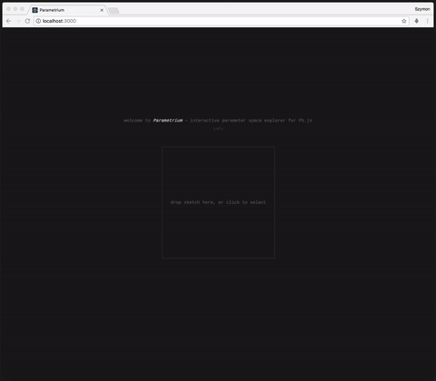

# Parametrium

## Interactive parameter space explorer for P5.js

Live: [http://szymonkaliski.github.io/parametrium](http://szymonkaliski.github.io/parametrium)

Made with [recast](https://github.com/benjamn/recast), [react](https://facebook.github.io/react/), [redux](https://github.com/reactjs/redux) and [immutable](https://facebook.github.io/immutable-js/).

Features AST-walker with number detection, and evolutionary algorithm adapted from [WallGen](http://szymonkaliski.github.io/wallgen).

## Run

1. clone this repo
2. `yarn` or `npm install`
3. `yarn run start` or `npm start`

## Build

1. `yarn run build` or `npm run build`

